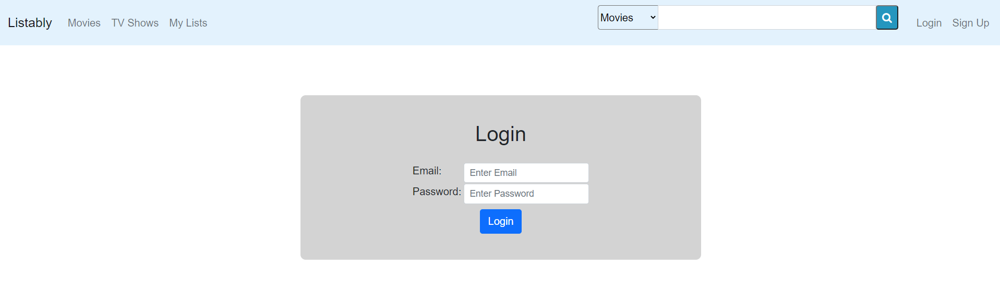
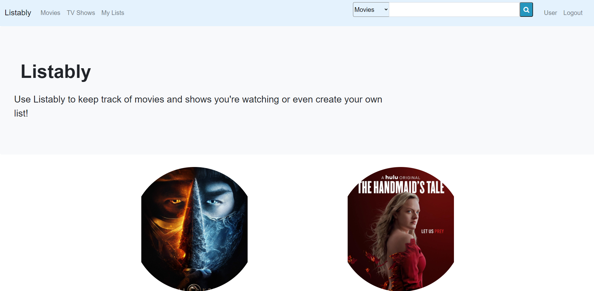
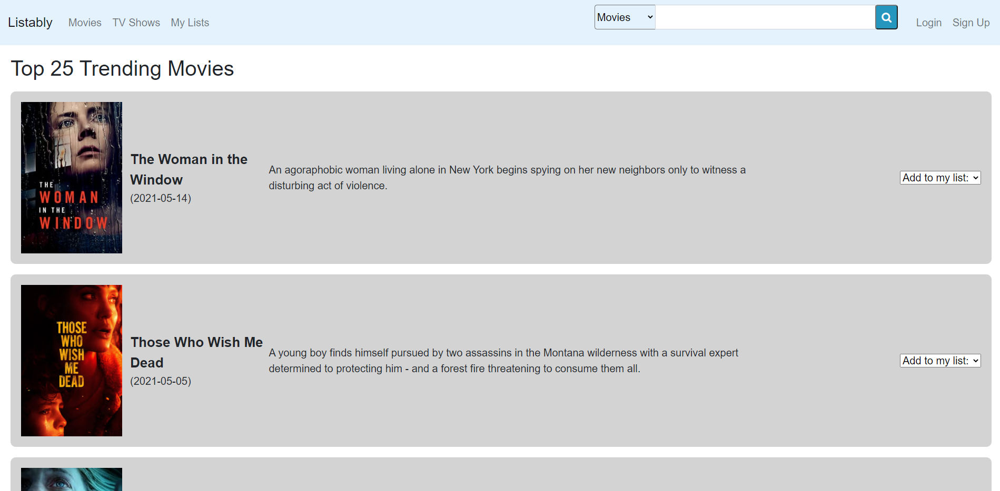
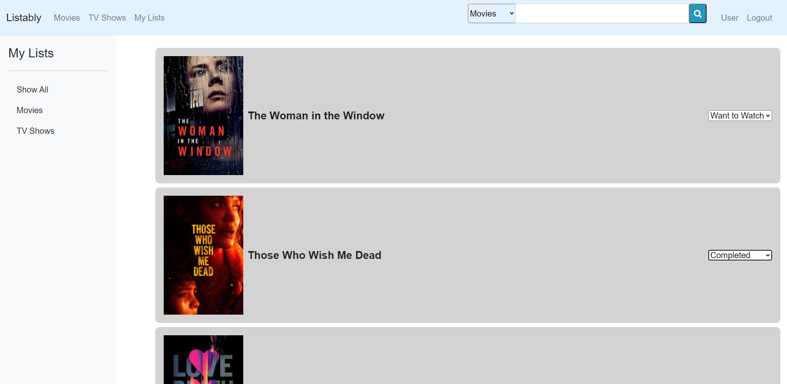

# Listably

## Description

Listably is a media consumption tracker where a user can find trending movies or TV shows or search for their own favourite movies or shows. The user can then add movies and shows into their own list for tracking purposes.

## Table of Contents

-   [Description](#description)
-   [Usage](#usage)
-   [Contributing](#contributing)
-   [Questions](#questions)

## Usage

1. Go to [Listably](listably1.herokuapp.com)
2. Please create an account or sign in on the top right corner of the page.

	

3. Navigate to the trending page by clicking Movies/TV Shows on the nav bar or the circular image from the home page or use the search bar to conduct a search. 
	

4. Add media that you would like to keep track on by using the dropdown on each card.  
    

5. Click on "My List" to see the media that you have saved to your list. Use the column on the left to filter your results.
    

## Contribution

#### Contributors

[Joseph Cordell](https://github.com/JosephCordell),
[Paul Jeffery](https://github.com/Paulndrwjeffrey),
[Melissa Tan](https://github.com/melissa-tan), and
[Kila Weeks](https://github.com/kilaweeks)

## Questions

If you have any questions or see any issues, please submit an [issue](https://github.com/JosephCordell/Listably/issues) on GitHub!
